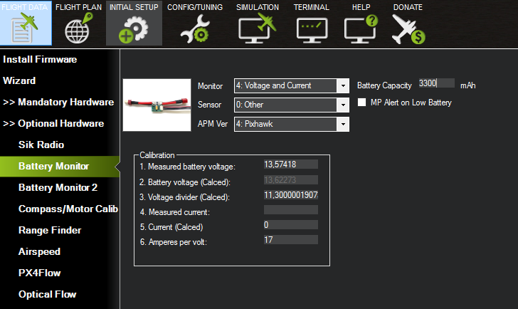

#### Second compass configuration

Navio2 contains two 9DOF IMU - MPU9250 and LSM9DS1. The latter has lower offsets and set as primary.
MPU9250 is disabled by default.

We're walking you through the steps requeired to perform the onboard compass calibration. It's a newer and a faster method to calibrate compasses.
Although, it's not fully supported by all GCS at the moment, due to an issue in Mission Planner we strongly suggest using this method. Otherwise, you might get Compass Variance errors.

## Onboard calibraton

Navigate to Initial Setup - Mandatory Hardwawre - Compass

- Tick **Use this compass** in **Compass #2** tab
- Click on **Start** button in **Onboard Mag Calibration** tab
- Rotate your drone around all axis
- Wait for calibration to complete (the process ends with a message similar to one on the picture attached below)


- Click **Accept** button (there's a change nothing's going to happen in responce)
- Swith to another view and get back to **Compass Calibration**
- Verify that offsets that have been calculated in the previous steps have been saved

#### Voltage and current sensing

If you have original power module connected to Navio2, you can get battery voltage and curent readings from it.


To setup voltage and current measurement for APM:

- switch to Initial Setup tab in Mission Planner
- navigate to Optional Hardware - Battery Monitor section
- set Monitor, Sensor and APM Ver options as shown below



Now you need restart both APM and connection between Mission Planner and APM:

- use Ctrl-F shortcut to open Temp Screen
- press 'reboot pixhawk' button
- on main menu bar press 'DISCONNECT' and then 'CONNECT'

When everything is done you should see voltage and current values on Flight Data screen. 

Also you can check in full parameter list that:

```bash
BATT_CURR_PIN 3
BATT_VOLT_PIN 2
```

#### Auxiliary function switches

Auxiliary function switches on channels 5-8 are still not supported and could lead to erroneous PWM generation on motors' channels.
We do ask to ***NOT SET AUXILIARY FUNCTION SWITCHES TO RC5..8***.

#### Further configuration

As other ArduPilot configuration procedures are very similar for most APM-running autopilot hardware, please use the APM documentation.

[Hardware configuration](http://ardupilot.org/copter/docs/configuring-hardware.html)

[ESC Calibration](http://ardupilot.org/copter/docs/esc-calibration.html)

[Enable RC Failsafe](http://ardupilot.org/copter/docs/radio-failsafe.html)!
