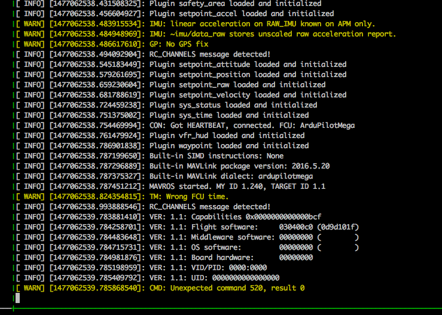
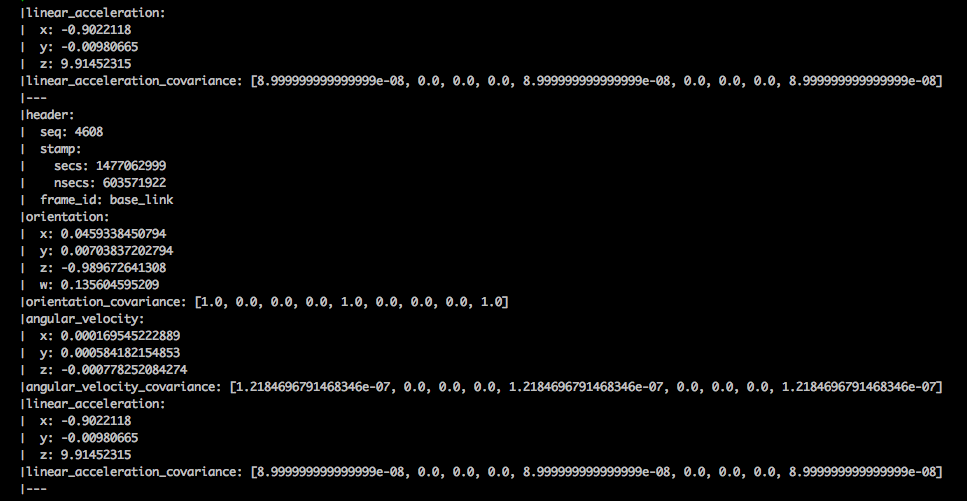

**ROS**

Emlid Raspbian images comes with preinstalled ROS.

#### What is ROS?

Robot Operating System is an endeavour by thousends of roboticists around the globe to make a developing of new robots easier. ROS is open source and includes ton of useful tools and that is making developing process more efficient. The idea is that you don't have to redesign the wheel to make a car. Someone else has already done that, and they've probably done it better than you, so you can focus your energy on specific part you want to build.
You can look more thouroughly on [ROS wiki](http://wiki.ros.org/) to get a better understanding of its concepts. 

### How to get your hands on?

#### ROS setup

ROS need a little setup. Namely this boils down to [sourcing](http://superuser.com/questions/176783/what-is-the-difference-between-executing-a-bash-script-and-sourcing-a-bash-scrip) a special script provided in /opt/:  

```
pi@navio: ~ $ echo "source /opt/ros/indigo/setup.bash" >> ~/.bashrc
```
A command above will make bash execute a ROS setup on every login by appending the line to the end of your ```bashrc```.

#### Introduction to tmux
You'll need to ```ssh``` into your Raspberry Pi using several terminals simultenously. That's why we recommend using a *terminal multiplexer* like [tmux](https://tmux.github.io/).

Before proceding any further we recommend looking up a tmux tutorial like this [one](https://danielmiessler.com/study/tmux/#gs.jMNdIc8) to get a grasp of the tool.

Create a tmux session called "ros"

```
pi@navio: ~ $ tmux new -s ros
```
And split your window into 4 panes like this:


Learn how to navigate between panes in an efficent manner using hotkeys.


#### Running roscore

Select top-left (doesn't matter which one, of course) one and run ```roscore```

```
pi@navio: ~ $ roscore
```

giving you something like this


```roscore``` is backbone of ROS. It makes its publisher-subscriber architecture tick.

#### Running ardupilot

Let's run ArduPilot in another pane as stated in [here](../Navio-APM/installation-and-running/#autostarting-ardupilot-on-boot) pointing telemetry to **127.0.0.1:14650**
by modifying ```/etc/default/ardupilot``` (```sudo nano /etc/default/ardupilot```)


```
pi@navio: ~ $ sudo systemctl start ardupilot
```

This command launches ArduPilot (one-shot. <sub>```sudo systemctl enable ardupilot``` to make it persistent</sub>). You'll see your LED blinking.

#### Running a GCS

[Launch](../Navio-APM/installation-and-running/#connecting-to-the-gcs) your GCS (Ground Control Station) of choice. 

#### Running mavros node

[mavros](http://wiki.ros.org/mavros) makes it easy to access sensor data from ArduPilot. 

Run this command in a next pane.

```
pi@navio: ~ $ rosrun mavros mavros_node \
_fcu_url:=udp://:14650@ \
_gcs_url:=udp://:14551@192.168.1.189:14550
```

- **14650**  is the same port we specified in ```/etc/default/ardupilot```
- **192.168.1.189:14550** is IP and port of the computer where GCS is launched.

In future you can create a custom [.launch](http://wiki.ros.org/mavros#Usage) file to launch it quicker. 

```
pi@navio: ~ $ roslaunch mavros custom.launch
```

After everything's set you'll see something like this:



#### Running rostopic

Run this command in the last pane created on the first step


```
pi@navio: ~ $ rostopic echo /mavros/imu/data
```


