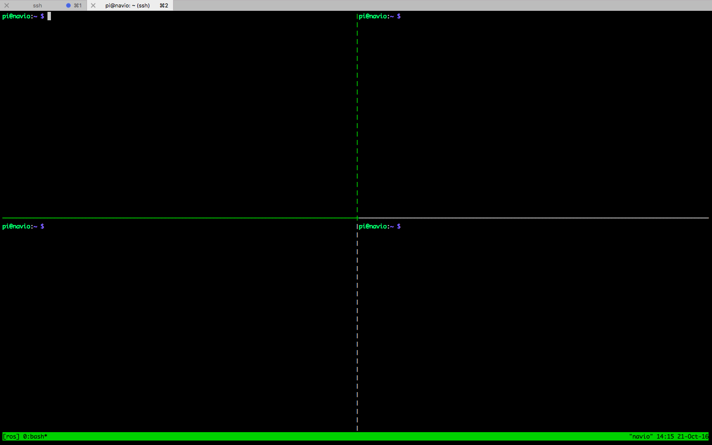
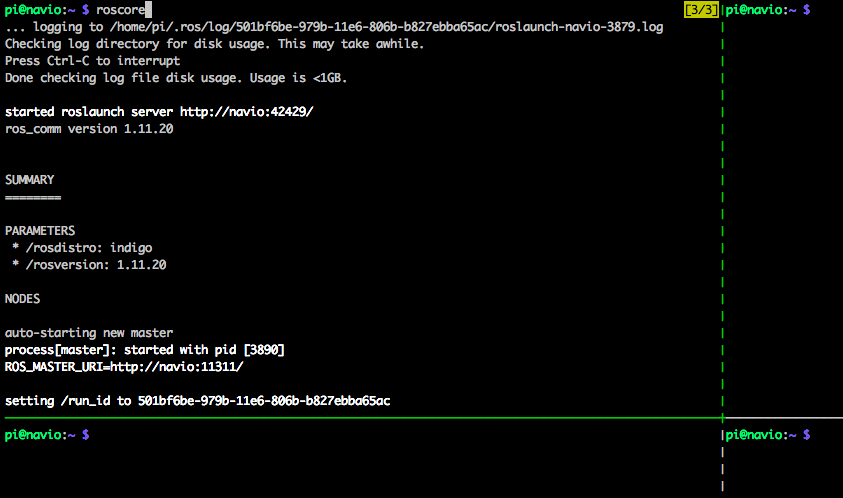
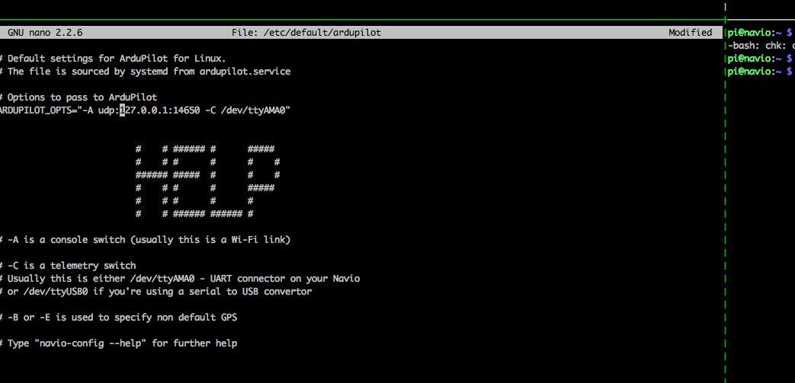

**ROS**

Emlid Raspbian images comes with preinstalled ROS.

### Basic understanding

#### What is ROS?

Robot Operating System is a delightful endeavour of thousends of roboticists around the globe to make a developing of new robots easier. ROS is an open source and includes ton of useful tools and that is making developing process more efficient. The idea is that you don't have to redesign the wheel to make a car. Someone else has already done that, and they've probably done it better than you, so you can focus your energy on specific part you want to build.

#### Overview

Here we will look at general scheme of ROS within Emlid Raspbian firmware. Firstly we will have a general concept of ROS system and then do everything step by step to get started promptly with some basic understanding. 

Emlids image is now including preinstalled ROS, so all we have to do is to start it after little setup (we will cover this step [very soon](#ros-setup)). After [running ROS](#running-roscore) we will find ourselves at ROS Master.
From this place we now are able to find Nodes and make them communicate to each other on you Raspberry Pi. For this moment we can imagine Node as an IMU-sensor for instance which gives us some data. Depending on node there might be different set and amount of sensors and devices drivers within one. 

////SCHEME 1


Now we are going just a little bit deeper. Nodes can find each other and share data within ROS Master. This data shared between nodes is called "Messages". Nodes can [buplish messages](#running-rostopic) to the topics  and may subscribe on topics to receive messages.

Let's take into consideration that we are running ROS for ardupilot. For your convenience Emlid image contains [Mavros node](#running-mavros-node) preinstalled. This node provides a lot of sensor drivers, communication driver for [Ardupilot](#running-ardupilot) and proxy to [GCS](#running-a-gcs).

///SCHEME2

To make things clear let's proceed to step-by-step ROS running instructions which will convert your general knowledge into practical skills helpful for getting started with ROS. 

You can look more thouroughly on [ROS wiki](http://wiki.ros.org/) to get a better understanding of its concepts. 


### How to get your hands on: step by step
#### ROS setup

ROS need a little setup before running. Namely this boils down to [sourcing](http://superuser.com/questions/176783/what-is-the-difference-between-executing-a-bash-script-and-sourcing-a-bash-scrip) a special script provided in /opt/:

```
pi@navio: ~ $ echo "source /opt/ros/indigo/setup.bash" >> ~/.bashrc
```
A command above will make bash execute a ROS setup on every login by appending the line to the end of your ```bashrc```.

Start watching video tutorial on <a href="https://asciinema.org/a/abkuvzfx8yg7aekcwow7udoq3?t=0" target="_blank">asciinema.org</a>.

#### Introduction to tmux
You'll need to ```ssh``` into your Raspberry Pi using several terminals simultenously. That's why we recommend using a *terminal multiplexer* like [tmux](https://tmux.github.io/).
For operating tmux while working with ROS you have to learn some basics. 
Before splitting the screen we have to create a new session:

```no-highlight
$ tmux new -s session-name
```

The following commands might be useful too:


To attach to an existing session:

```no-highlight
$ tmux a-t session-name
```

To detach from session:
```no-highlight
$ tmux detach
```
To kill session:
```no-highlight
$ tmux kill-session -t session-name
```

Inside sessions we have to operate and navigate somehow with a number of functions. For this Tmux has a *universal shortcut* that lets you quickly perform many tasks. 

Shortcut activation by default:
```no-highlight
Ctrl+b
```
After activation of Ctrl+b you have a number of options.

```no-highlight
? - get help

$ - rename current session

% - split horizontally

" - split vertically

o - toggle between panes

x - kill the current pane
```

For further information please refer to this [tutorial](https://danielmiessler.com/study/tmux/#basics).


### Preparing terminal
Create a tmux session called "ros"

```bash
pi@navio: ~ $ tmux new -s ros
```
And split your window into 4 panes like this:



We recommend you to take your time and practice to navigate between panes in an efficient manner using hotkeys.

Continue <a href="https://asciinema.org/a/abkuvzfx8yg7aekcwow7udoq3?t=57" target="_blank">watching the tutorial</a> for this step.


#### Running roscore

Now it's time to start ROS Master. Select top-left (doesn't matter which one actually) pane and run ```roscore```

```
pi@navio: ~ $ roscore
```
If you were sucessfull bash will show you the following and you'll see Master started on Raspberry Pi.



Continue <a href="https://asciinema.org/a/abkuvzfx8yg7aekcwow7udoq3?t=2:20" target="_blank">watching the tutorial</a> for this step.

```roscore``` is a backbone of ROS. It's the first thing you should run when using ROS because it's vital for successful Node execution and making publisher-subscriber architecture.

#### Running ardupilot

Let's run ArduPilot in another pane as stated in [here](../Navio-APM/installation-and-running/#autostarting-ardupilot-on-boot) pointing telemetry to **127.0.0.1:14650**
by modifying ```/etc/default/ardupilot```:

```no-highlight
sudo nano /etc/default/ardupilot
```



Then type:

```
pi@navio: ~ $ sudo systemctl start ardupilot
```

This command launches ArduPilot (one-shot. <sub>```sudo systemctl enable ardupilot```</sub> to make it persistent). You'll see your LED blinking.

In case you are making changes in ardupilot while it's working, you should then restart:

```
pi@navio: ~ $ sudo systemctl restart ardupilot
```

Continue <a href="https://asciinema.org/a/abkuvzfx8yg7aekcwow7udoq3?t=3:40" target="_blank">watching the tutorial</a> for this step.

#### Running a GCS

[Launch](../Navio-APM/installation-and-running/#connecting-to-the-gcs) your GCS (Ground Control Station) of choice. On the next step you'll understand why. 

#### Running mavros node

As we've already discussed within the ROS package we are working with an executable files called Nodes. Each ROS Node contains specific functions and uses a ROS client library to communicate with other nodes. For example, we will run [mavros](http://wiki.ros.org/mavros) which makes it easy to access sensor data from ArduPilot. Moreover according to the scheme from the overview, mavros will become a udp bridge to Ground Control Station we've launched on previous step.

Run this command in a third pane:

```
pi@navio: ~ $ rosrun mavros mavros_node \
_fcu_url:=udp://:14650@ \
_gcs_url:=udp://:14551@192.168.1.189:14550
```
Make sure that:
- **14650**  is the same port we specified in ```/etc/default/ardupilot```
- **192.168.1.189:14550** is IP and port of the computer where GCS is launched.

If you feel enthusiastic in future you can create a custom [.launch](http://wiki.ros.org/mavros#Usage) file to launch it quicker. 

```
pi@navio: ~ $ roslaunch mavros custom.launch
```

Finally after everything's set you'll see something like this:


Continue <a href="https://asciinema.org/a/abkuvzfx8yg7aekcwow7udoq3?t=5:06" target="_blank">watching the tutorial</a> for this step.

#### Running rostopic

``rostopic`` tools allows you to get information about ROS topics.

To learn sub-commands for ``rostopic`` you can use help option:
```
$ rostopic -h
```

For mavros we will run *echo* command in the last pane to show the data published on topic.

```
pi@navio: ~ $ rostopic echo /mavros/imu/data
```


After typing *rostopic echo /mavros/* you can press TAB to see the list of existing topics and check them to practice more.

Continue <a href="https://asciinema.org/a/abkuvzfx8yg7aekcwow7udoq3?t=6:49" target="_blank">watching the tutorial</a> for this step.


